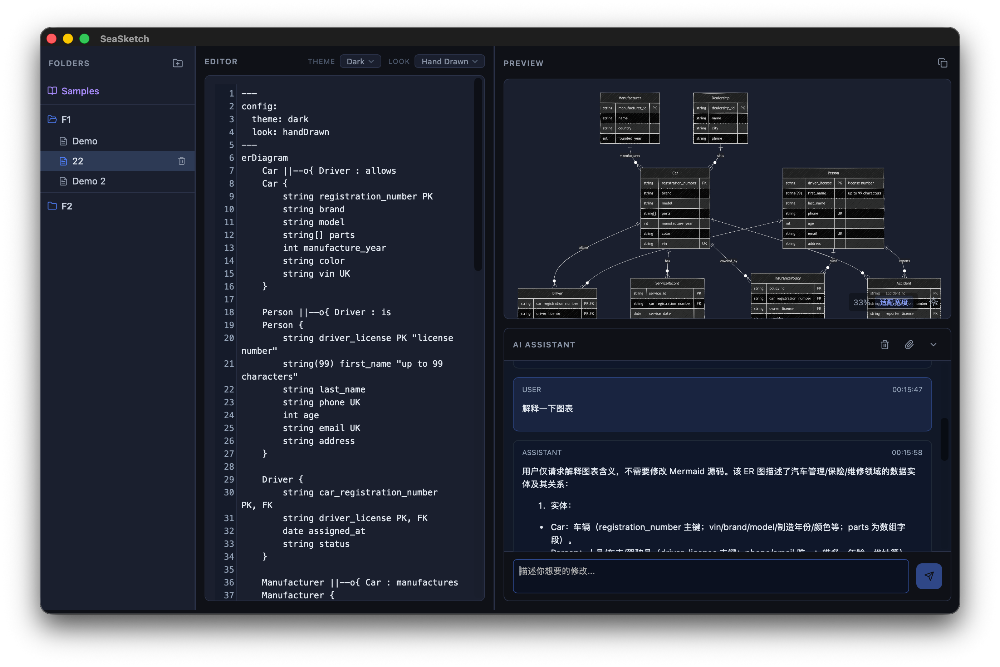
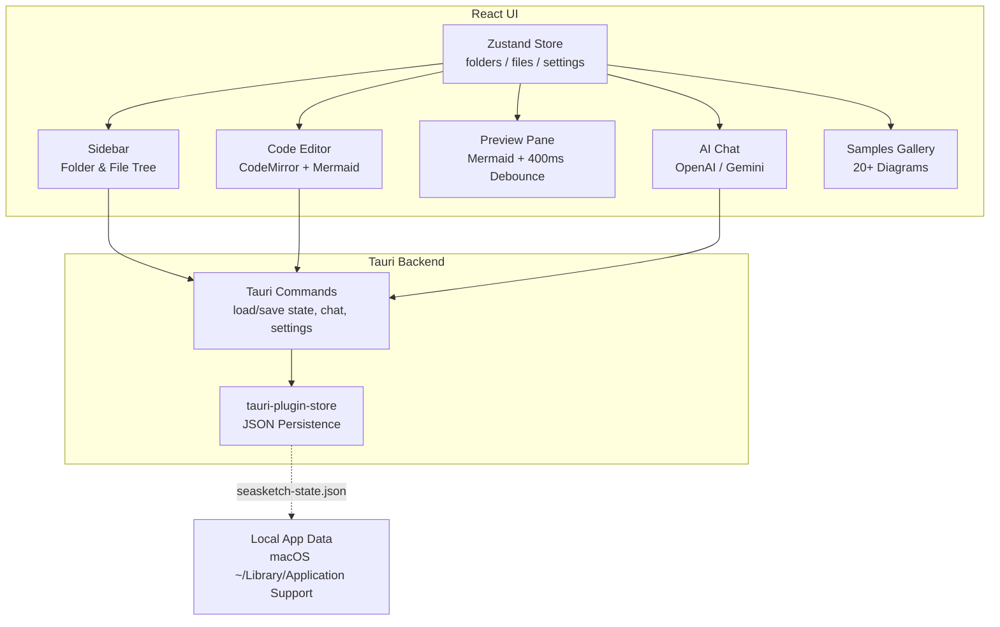

# SeaSketch

SeaSketch is a macOS application built with Tauri and React that lets you author Mermaid diagrams locally with real-time preview.

## Overview
- **Target platform**: macOS (Tauri desktop app)
- **UI stack**: React (frontend) + Tauri (Rust backend)
- **Core capability**: Edit Mermaid diagram text and preview it live after typing stops (400ms debounce)
- **Data model**: Folders contain files; each file stores Mermaid content
- **Persistence**: Uses the Tauri storage plugin to persist folders/files locally

## Key Features
1. **Mermaid editor with delayed live preview**
   - Users type Mermaid syntax; when typing stops the preview re-renders (400ms debounce)
   - Errors during rendering are surfaced without clearing the last successful preview
2. **Folder and file management**
   - Create/rename/delete folders
   - Each folder manages its own list of files (create/rename/delete)
   - Files belong to exactly one folder
3. **Local persistence**
   - Entire folder/file tree, including each file's Mermaid content, is saved via the Tauri storage plugin
   - On app launch, existing data is loaded; a default folder/file is created if none exist
4. **Samples gallery**
   - Built-in collection of 20+ Mermaid diagram examples (flowchart, sequence, class, state, ER, gantt, pie, mindmap, timeline, git graph, journey, quadrant, XY chart, sankey, block diagram, architecture, kanban, packet diagram, and more)
   - Samples are read-only but users can copy content to create new diagrams
5. **AI-assisted diagram generation**
   - Chat with AI (OpenAI GPT or Google Gemini) to generate Mermaid diagrams
   - Supports OAuth authentication for Gemini
   - Attach files to conversations for context-aware diagram generation
6. **Preview enhancements**
   - Toggle between dark/light background
   - Pan (drag) and zoom (scroll wheel) support
   - Fit to width button for easy viewing
   - One-click SVG copy to clipboard
7. **Theme customization**
   - Select Mermaid themes: Default, Base, Dark, Forest, Neutral
   - Choose visual styles: Classic, Hand Drawn
8. **Adjustable layout**
   - Resizable sidebar and editor panels
   - Layout preferences are persisted

## High-Level Architecture

## Implementation Roadmap
1. Initialize a Tauri + React project (SeaSketch)
2. Install dependencies: `@tauri-apps/plugin-store`, `mermaid`, CodeMirror, Zustand
3. Configure Tauri to expose `loadState` / `saveState` commands and register the store plugin
4. Build React state layer for folders/files and current selection using Zustand
5. Implement Folder/File management UI with create/rename/delete
6. Implement the editor + 400ms debounce preview with error handling
7. Add samples gallery with 20+ built-in diagram examples
8. Implement AI chat integration (OpenAI/Gemini) with OAuth support
9. Add preview enhancements (zoom, pan, background toggle, SVG export)
10. Hook persistence into every structural/content change
11. Polish UI, test flows, package for macOS

---

# Development Notes

## Useful Scripts
- `npm run dev` – start the Vite dev server
- `npm run tauri dev` – run the Tauri desktop app in development
- `npm run build` – type-check and build the frontend
- `npm run tauri build` – produce a distributable macOS build

Package management is handled via **npm** (pnpm intentionally not installed).
